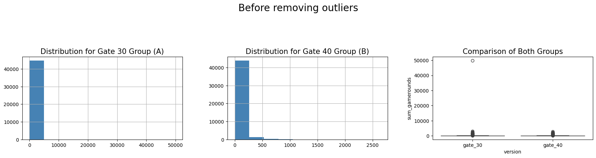

##  Project Background 
**What is Cookie Cats?**

"Cookie Cats" is a mobile game developed and published by Tactile Entertainment. The gameplay is similar to other match-three games (like Candy Crush).

Players may encounter certain obstacles in the game, such as having to wait before continuing to play or purchasing items to pass a level. Imagine that while playing the game, you face some levels where you need to wait for a certain period to unlock or buy power-ups to progress.

In this project, we are analyzing the results of an A/B test. A/B testing is a common experimental design method where one group of players (Group A) experiences one situation, and another group (Group B) experiences a different situation. In this example, we moved the first gate in the Cookie Cats game from level 30 to level 40, and then we will analyze how this change affects players.

We will mainly focus on two aspects: player retention rate and number of game rounds.

Retention rate refers to the degree of continued player engagement, i.e., whether they keep playing the game after some time.
Game rounds refer to the number of game sessions or levels a player plays. By analyzing these data, we can understand how the change in gate position affects player behavior.

**Project Requirements**

Using pandas: Pandas is a popular Python library used for data manipulation and analysis. DataFrames are a data structure in Pandas, similar to Excel spreadsheets, which can conveniently store and manipulate data. For example, if you have a CSV file containing student grades, you can use Pandas to load it into a DataFrame and calculate average grades, filter for passing students, etc.

Using relevant plotting methods: Pandas integrates with matplotlib and seaborn for data visualization. You can create various charts, such as line plots and bar charts, especially when plotting distribution plots.

Understanding hypothesis testing logic and bootstrap analysis for different types of metrics: Hypothesis testing is used to determine whether the differences in player retention rate and number of game rounds are statistically significant. Bootstrap analysis estimates the statistical distribution of these metrics through resampling. For example, to compare the average retention rate between two groups of players, you can use hypothesis testing. If you want to estimate the confidence interval for retention rate, you can use the bootstrap method.

In the realm of mobile gaming, maintaining player engagement is paramount. “Cookie Cats,” a captivating puzzle game developed by Tactile Entertainment, serves as an excellent case study for this. The game’s clever integration of “connect three” mechanics with an adorable ensemble of singing cats has charmed players worldwide. However, the strategic placement of progression gates — points where players must either wait or make a purchase to advance — brings a crucial analytical challenge to the forefront: optimizing player retention.

## Understanding the Game Mechanics

At its core, “Cookie Cats” employs a common yet effective monetization strategy: progression gates. These gates, strategically placed at certain levels, necessitate either a waiting period or an in-app purchase, ingeniously pacing the gameplay. This mechanic not only drives revenue but also aims to enhance the player’s enjoyment by preventing burnout.

## The Analytical Challenge: Gate Placement

The initial placement of the first gate at level 30 posed an interesting question: could player retention be improved by relocating this gate? To explore this, an AB test was conducted, shifting the first gate to level 40 for a subset of players. The goal was to analyze the impact on player retention, an essential metric for the game’s long-term success.

### Data Discription 
1. The dataset was collected from an ongoing A/B test in a game, with a total of 90,189 players who installed the game during the A/B test period.

  1. **userid**: A unique identifier for each player, used to distinguish between different players.

     Example: Suppose there are players A, B, and C, with userids 123, 456, and 789, respectively.

  2. **version**: The experimental group to which the player is assigned, either the control group or the test group.

     - **gate_30**: Players assigned to the control group, where their first gate is at level 30.
     - **gate_40**: Players assigned to the test group, where their first gate is at level 40.

     Example: Player A is assigned to the gate_30 group, while Player B is assigned to the gate_40 group.

  3. **sum_gamerounds**: The number of game rounds a player played during the first week after installing the game.

     Example: Player A played 10 game rounds in the first week, while Player B played 20 game rounds.

  4. **retention_1**: Whether the player logged into the game again on the first day after installing the game.

     - **1**: The player logged in again on the first day.
     - **0**: The player did not log in again on the first day.

     Example: Player A did not log in again on the first day, while Player B did.

  5. **retention_7**: Whether the player logged into the game again on the seventh day after installing the game.

     - **1**: The player logged in again on the seventh day.
     - **0**: The player did not log in again on the seventh day.

     Example: Player A logged in again on the seventh day, while Player B did not.。
     
## Data-Driven Insights with Python

Leveraging Python, a powerful tool for data analysis, we delved into the game’s AB test data, encompassing 90,189 players. The data included metrics such as the number of game rounds played within the first 14 days post-installation and retention rates one and seven days after installation. Python’s Pandas library facilitated efficient data manipulation and analysis, allowing for a clear comparison between the control group (gate at level 30) and the test group (gate at level 40).

### Cleaning Data

### Insights

### Statistic Modeling

## Bootstrap Analysis: A Closer Look at Retention Rates

Bootstrap analysis, a robust statistical method, was employed to assess the certainty of our findings. By resampling the dataset and calculating retention rates, we could estimate the variability of our metrics. This analysis revealed a slight decrease in 1-day retention for the level 40 gate, a small but significant insight given the impact of retention on player base and revenue.

## Visualizing Data with Python

Data visualization played a pivotal role in our analysis. Using Python’s Matplotlib library, we plotted the distribution of game rounds played and the bootstrap analysis results, offering a clear, visual representation of our findings. These visualizations not only made the data more accessible but also highlighted the nuanced effects of gate placement on player engagement.

## Strategic Decision-Making: To Move or Not to Move the Gate?

The culmination of our analysis pointed to a clear conclusion: moving the gate to level 40 adversely affected player retention. This insight, grounded in rigorous data analysis and bootstrap analysis, underscores the importance of data-driven decision-making in game development and monetization strategies.

## The Power of AB Testing and Data Analysis

This case study exemplifies the critical role of AB testing and data analysis in optimizing player engagement and retention. By leveraging Python for data manipulation, analysis, and visualization, we can derive actionable insights that inform strategic decisions. For game developers and analysts alike, embracing these tools and techniques is essential for fostering a vibrant, engaged player base.

## The steps of AB Testing

  A complete A/B test generally includes the following parts:

  1. **Analyze the current situation and form a hypothesis**: Analyze the business, identify the highest-priority improvement areas, form a hypothesis, and propose optimization suggestions.
  2. **Set key metrics**: Define primary metrics to evaluate the performance of different versions; set secondary metrics to assess other impacts.
  3. **Design and development**: Design the prototype of the optimized version and complete the development.
  4. **Determine the test duration**: Decide the duration of the test.
  5. **Determine the traffic splitting plan**: Determine the traffic distribution ratio for each test version and other details related to traffic splitting.
  6. **Collect and analyze data**: Collect experimental data and assess the validity and effectiveness of the results.
  7. **Draw conclusions**:
     - ① Decide whether to release the new version.
     - ② Adjust the traffic distribution and continue testing.
     - ③ Optimize the iteration plan, redevelop, and go back to step 1.

